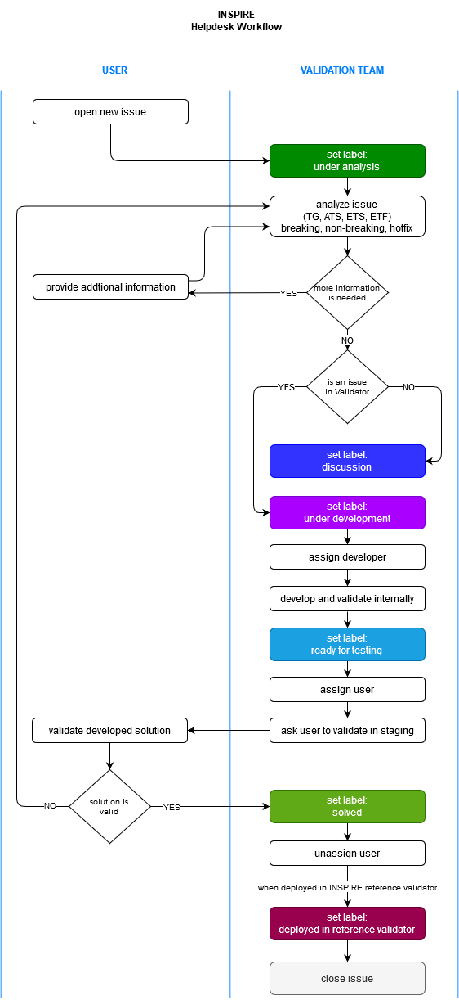

# Introduction
The establishment of an adequate communication channel with the community is an important objective for the provision of the INSPIRE Reference Validator environment service.
For this, the issue management functionalities offered by GitHub are being used, providing assistance to the users' requests, as well as offering detailed information of the changes and hotfixes that will be included in the different versions.
In this way, a workflow is established for the Helpdesk Management that allows to carry out in a systematic and organized way the management of the different issues that are incorporated to the Community repository.
So, the aim of this document is to explain in detail the procedure established for the issues management in order to have a proper understanding in the defined process for its management.

# Helpdesk Management Workflow
In order to establish a proper issues management procedure, it has been created a workflow that allows to know at any moment the state of an issue. This workflow defines a set of actions for the resolution of issues in which both the users and the Validation Team will participate.
In this Helpdesk Management Workflow, issues go through a series of status that are marked by means of the use of labels that identify in a simple way the actions taken until the moment and the next actions to take.
In summary, the tags that an issue can be assigned with are the following:
* under analysis: indicates that the Validation Team is performing an analysis of the scope of the issue
* under development: shows that the Validation Team is running a development according to the analysis of the issue
* ready for testing: the development associated with the issue has been carried out and is available to the user for validation in the INSPIRE Reference Validator Staging environment
* solved: once the user has confirmed that the development carried out is adequate, the issue is marked as solved
* closed: an issue is tagged as "closed" when it has been deployed in the INSPIRE Reference Validator environment
* discussion: if it is not an issue directly related with the INSPIRE Reference Validator or it is a new feature requested by an user, it is labeled for discussion

Below is a diagram describing the workflow of an issue, along with the states in which it can be found and which actor takes action on it.

In the diagram above, the workflow is triggered by the submission of an issue in GitHub by a community user.

In the first instance, the Validation Team contacts the user and sets a tag "under analysis" to proceed to collect the necessary information to solve the issue. At this point, it is possible to iterate with the user to request more detail about the submitted issue.

Once there is enough information, the issue is classified either as "discussion", in case it is not an issue directly related to the Validator or it is related with a new feature request, or as "under development", so the tasks associated to its resolution are carried out.

After the development of the tasks for the resolution of the issue and its integration in the INSPIRE Reference Validator Staging environment, the issue is marked as "ready for testing". At this stage, the explicit validation of the user is requested to ensure that the resolution of the issue provides, in fact, enough coverage to the needs initially requested. 

If the resolution of the issue covers the needs raised, it is incorporated into the INSPIRE Reference Validator roadmap and, once this issue is deployed in the production environment, the issue is marked as "closed". Otherwise, the workflow may go back in order to iterate until the issue is finally closed.

In this way, the workflow for attending to incidents related to the INSPIRE Reference Validator is completed.
