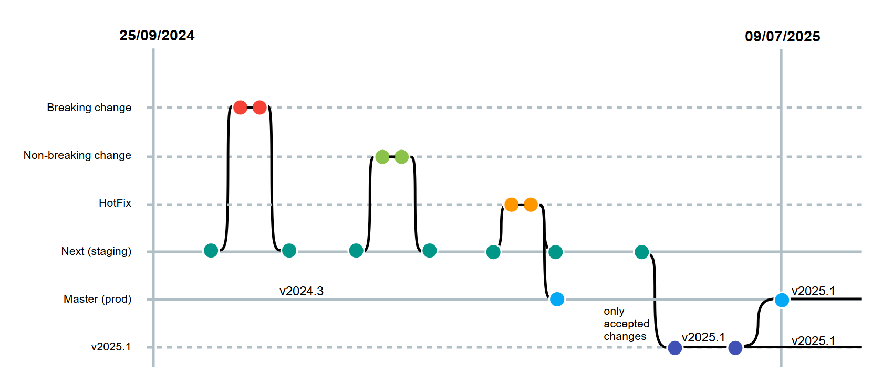

# Table of contents
- [Introduction](#introduction)
- [Objective and Summary](#objective-and-summary)
- [Release Planning](#release-planning)
  * [Instances of the INSPIRE Reference Validator](#instances-of-the-inspire-reference-validator)
  * [Annual releases](#annual-releases)
    * [v2025.1 - 09/07/2025](#v20251---09072025)
- [Release Delivery](#release-delivery)

# Introduction

This document illustrates the release planning strategy for the [INSPIRE Reference Validator](https://inspire.ec.europa.eu/validator/), including all its components (ATS, ETS and ETF). The document explains the rationale behind the plan and details the annual release together with its main expected changes. It also lists a number of resources for users to get informed on the future expected changes (future releases) in the INSPIRE Reference Validator and to check in detail the content of each released version (past releases).

# Objective and Summary

The objective of this document is to explain the release planning process for the INSPIRE Reference Validator in an open, clear and transparent way to the INSPIRE community in order to ensure that stable validation criteria are provided and communicated efficiently. The release plan is beneficial to the whole INSPIRE community, in particular to Member States data providers and implementers in preparation to the Monitoring process that takes place each year in December and makes use of the INSPIRE Reference Validator.

Until 2024, the plan included 4 releases per year happening in January, March, June and September. While the January, March and June releases included both breaking changes (i.e. changes which make tests more restrictive as well as new tests) and non-breaking changes (i.e. changes which do not make tests more restrictive as well as changes to the interface, which do not impact the tests), the September release - which was used for the end-of-year Monitoring process - only included non-breaking changes in order to give INSPIRE data providers and implementers sufficient time to prepare for the Monitoring deadline in December.

Starting from 2025, the release plan only includes one release per year scheduled in June, again including both breaking changes and non-breaking changes, which is the release used for the end-of-year Monitoring process. In addition, in case of need hotfix releases (i.e. releases including fixes to major bugs or faults) will be released as quickly as possible in addition to the June release.

# Release Planning

## Instances of the INSPIRE Reference Validator

Two instances of the INSPIRE Reference Validator are currently available, which have different purposes:

* [Production instance](http://inspire.ec.europa.eu/validator/): this is the reference instance used for validating INSPIRE resources in the end-of-year Monitoring process. It only includes the consolidated changes, i.e. changes which have been already tested and approved by the INSPIRE community. Releases of the INSPIRE Reference Validator always refer to releases of the Production instance.

* [Staging instance](https://inspire.ec.europa.eu/validator-staging): this instance includes all the latest changes to the INSPIRE Reference Validator, including new tests and new functionality, before these are also moved to the Production instance within a release. The Staging instance is only used for testing purposes by the INSPIRE community.

## Annual release

As mentioned above, as of 2025 a single release of the INSPIRE Reference Validator is scheduled each year, which includes all breaking and non breaking changes used for the end-of-year Monitoring process. The scheduled annual release is described in detail in the next sub-section. In addition to the different infrastructure and deployment environments, the different releases are managed using different branches of the [_ets-repository_](https://github.com/inspire-eu-validation/ets-repository) repository.

For simplicity, the descriptions make explicit reference to the release in the year 2025, but the same release schedule will be applied consistently over the following years:

* **v2025.1 - 09/07/2025**: it includes both breaking and non-breaking changes. This release is the one used for the end-of-year Monitoring process.

### v2025.1 - 09/07/2025
This release is scheduled on 09/07/2025 and includes the breaking and non-breaking changes occurred since the previous release (v2024.3). All these changes (each managed in a dedicated branch) are first incorporated in the _staging_ branch, i.e. they are made available in the Staging instance; afterwards, each change which is also tested and accepted by the user who originally reported it, is also incorporated in the _v2025.1_ branch. This branch is finally merged into the _master_ branch, which will make all changes available in the Production instance. Should hotfixes be needed at any time, they are immediately incorporated both in the _staging_ and the _master_ branches.

# Release Delivery
Each release of the INSPIRE Reference Validator is fully managed and made available to the INSPIRE community through the following set of GitHub artifacts: 

* a **GitHub milestone**, named _v202x.y (dd/mm/yyyy)_ and published on the [Milestones section of the _community_ repository](https://github.com/INSPIRE-MIF/helpdesk-validator/milestones); the milestone lists the issues whose solutions are expected to be included in the corresponding _v202x.y (dd/mm/yyyy)_ release;

* a **GitHub release**, named _v202x.y (dd/mm/yyyy)_ and published on the [Release section of the _community_ repository](https://github.com/INSPIRE-MIF/helpdesk-validator/releases). The release notes include:
  - a list of new features to the ATS, ETS and ETF
  - a list of bugfixes, each with the corresponding issue and pull request
  - a list of the enhancements, each with the corresponding issue and pull request
  - the new documentation produced, if any
  - assets, i.e. code packages required for deployment:
    - _ets-repository-v202x.y.zip_, containing the _ets-repository_ repository corresponding to the release branch;
    - _inspire-registry-resources.zip_, containing the resources that the INSPIRE Reference Validator requests to the INSPIRE Registry to execute the validations defined in the Executable Test Suites (ETSs);
    - _inspire-validator-v202x.y.zip_, containing the INSPIRE Reference Validator deployment instructions and artifacts;
    - _Source code.zip_ and _Source code.tar.gz_, including the content of the _community_ repository for the current release;
	  
* a **GitHub package**, published on the [Packages section of the _community_ repository](https://github.com/INSPIRE-MIF/helpdesk-validator/packages), including the instructions and resources needed to deploy the corresponding release of the INSPIRE Reference Validator through the use of Docker.

* update of the **[GitHub issue tracker of the _community_ repository](https://github.com/INSPIRE-MIF/helpdesk-validator/issues)** by changing the label of the issues solved within the corresponding release from _solved_ to _deployed in reference validator_ and by closing them (see also the [helpdesk management workflow](https://github.com/INSPIRE-MIF/helpdesk-validator/tree/master/helpdesk%20management));

* update of the **[Validator issues project board](https://github.com/orgs/INSPIRE-MIF/projects/9)** by moving all the issues labeled as _deployed in reference validator_ to the column _Production: latest release_.
